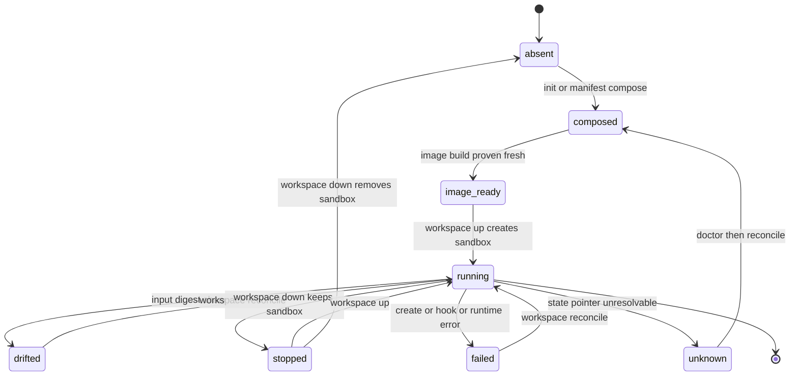

# Workspace lifecycle and shell UX

> **Theses** — A: *the sandbox is the interface* (`podbox shell`, shown first in help);
> B: *reconcile-on-change is the everyday path* (`workspace reconcile`, first-class & idempotent).

> Normative. Defines the shell-centric UX, workspace identity, the sandbox lifecycle state and drift
> model, the semantics of `up` / `reconcile` / `shell` / `exec` / `down`, lifecycle hooks, and the
> terminal/agent pairing scenario. Sections labelled **Reference Evidence** are non-normative.
>
> This document defers to the canon documents for command names, flags, and exit codes — every
> command and flag it uses is defined in [`02-command-surface.md`](02-command-surface.md), and the
> hard rules it elaborates are collected in [`11-invariants-and-guarantees.md`](11-invariants-and-guarantees.md)
> (chiefly **I1**, **I2**, **I3**, **X1**, **X2**, **U1**, **U5**).

## 1. Shell-centric model

Entering the sandbox to work is the **central interface** the rest of the design serves (**U1**).
`podbox shell` MUST be the shortest happy path: ensure the workspace is ready, start or reconcile it
per policy, and place the user inside the sandbox quickly.

```text
podbox shell [--workspace <path>] [--manifest <name>] [--reconcile auto|always|never] [--] [command...]
```

- With no trailing command, `shell` MUST enter an **interactive, login-capable shell** inside the
  sandbox.
- With a trailing command after `--`, `shell` MUST run that command **as an argv vector** in a
  login-capable context — never as a multi-line shell blob (**X1**, see §6).
- `shell` MUST bring the workspace **up if it is absent**, and MUST state that it is doing so.
- `shell` reconciles per the `--reconcile` policy (default from `config.toml` `defaults.reconcile`,
  itself defaulting to `auto`); the policy semantics are in §5.

## 2. Workspace identity

Each sandbox MUST be keyed by a stable **workspace identity** — the canonical workspace path plus a
stable identity label — so that work-clones of the same repository remain **separate** sandboxes with
separate lifecycle state (**I1**). Two clones of one repository at different canonical paths MUST NOT
share a sandbox, image identity, or reconcile state.

- Identity is recorded in the `[[projects]]` registry in `config.toml`
  ([`03-…`](03-config-and-xdg-layout.md) §3) and in the state root's sandbox-identity mapping
  ([`09-state-cache-and-data-model.md`](09-state-cache-and-data-model.md)).
- All `workspace` verbs and top-level `shell`/`status` resolve the target workspace by this identity
  (default: the current directory; overridable with `--workspace <path>`), and match the running
  sandbox by its identity label.

## 3. Lifecycle states

A workspace sandbox moves through these states:

- **absent** — no sandbox and no composed artifact for the workspace.
- **composed** — the composed `devcontainer.json` exists and is fresh (see
  [`04-…`](04-manifest-and-composition-model.md) §7), but no sandbox exists yet.
- **image·ready** — the image the composed config requires is present and provably fresh (see
  [`06-…`](06-image-builds-and-change-detection.md)).
- **running** — a sandbox exists and is up for the workspace identity.
- **drifted** — a running sandbox whose live inputs no longer match its composed/built inputs (see
  §4).
- **stopped** — a sandbox that exists but is not running.
- **failed** — a create/start/hook/runtime error left the sandbox unusable.
- **unknown** — state cannot be determined (e.g. the state pointer references a runtime resource that
  no longer exists).

The following diagram is mermaid **10.2.x-safe** (only `stateDiagram-v2`; `·` replaces parentheses in
labels):



Transitions in prose: `init`/`manifest compose` moves **absent → composed**; a proven-fresh image
moves **composed → image·ready**; `workspace up` (or `shell` on an absent workspace) creates the
sandbox, **image·ready → running**; a detected input change marks a running sandbox **drifted**;
`workspace reconcile` returns **drifted → running** (and recovers **failed → running** and
**unknown → composed → running**); `workspace down` yields **running → stopped** or
**running/stopped → absent** depending on whether it removes the sandbox.

## 4. Drift detection

A running sandbox is **drifted** when any of the following differs from the inputs it was created
from:

- the selected **manifest** digest;
- any composed **layer** digest;
- the **local-override** digest (a permitted workspace-local config, per
  [`03-…`](03-config-and-xdg-layout.md) §5);
- the **image-source** digest (see [`06-…`](06-image-builds-and-change-detection.md));
- the **runtime policy**, **mount policy**, or **network policy** in effect; or
- the **config schema version** or composition-rules version.

`status` and `workspace status` MUST report drift and its cause; `up` MUST detect drift of a running
sandbox and point the user to `reconcile` (see §5). Drift is computed from the same content-and-
version digests used for composition freshness (**P5**) and build freshness (**B1**), not from mtime
alone.

## 5. `up` / `reconcile` / `shell` / `exec` / `down`

All flags and synopses below are defined in [`02-command-surface.md`](02-command-surface.md) §4.5.

### 5.1 `up`

`podbox workspace up [--workspace <path>] [--manifest <name>]` MUST **start a sandbox if the
workspace is absent** from the resolved config, and MUST NOT recreate an existing healthy sandbox
unless explicitly asked. On detected **drift of a running sandbox**, `up` MUST report the drift and
point to `reconcile`, and MUST NOT silently recreate the sandbox unless policy explicitly allows it.
When no config resolves for the workspace, `up` fails with exit code `2` and the actionable remedy
defined in [`03-…` §5](03-config-and-xdg-layout.md) (`no config for <workspace>`; run `podbox init`
or pass `--config`), per invariant **C8**. Exit code `5` is reserved for commands that require an
already-existing or running sandbox (e.g. `exec`, `shell` under `--reconcile never`), not for `up`,
which creates the sandbox.

### 5.2 `reconcile` (the promoted `reup`)

`podbox workspace reconcile [--workspace <path>] [--dry-run] [--yes]` is the **first-class**,
**idempotent** path after any config, manifest, image, mount, or runtime-policy change, and is the
**recommended path after any config edit** (**I2**). It is the formal replacement for the legacy
`ws reup` habit and MUST be cheap and fast enough to be routine. In order, `reconcile` MUST:

1. **recompose** the `devcontainer.json` (see [`04-…`](04-manifest-and-composition-model.md)),
   protecting the user's leaf layer while reconciling shared layers (**P2**);
2. **ensure image freshness**, rebuilding per policy or failing with remediation
   ([`06-…`](06-image-builds-and-change-detection.md); exit `6` on build failure);
3. **safely stop and remove** the old sandbox;
4. **create** a new sandbox for the same workspace identity; then
5. **run lifecycle hooks by argv vector** (§6, **X1**); and
6. report a **summary** of what changed.

`reconcile` is destructive to the running sandbox (it recreates it), so it is gated per **U5**:
`--dry-run` reports the plan without mutating; `--yes` bypasses confirmation. Its net effect on
config is non-destructive to the user's leaf layer (Guarantee *Non-destructive reconcile*).

### 5.3 `shell` reconcile policy

`shell` applies the `--reconcile` policy (default `auto`):

- **`auto`** — reconcile when drift is detected; if recreation would be **destructive** and the
  session is on an interactive **TTY**, prompt for confirmation before recreating; if the session is
  **noninteractive**, do **not** silently recreate — fail with a clear, specific exit code and point
  to `workspace reconcile`.
- **`always`** — reconcile unconditionally before entering (bypasses the noninteractive failure).
- **`never`** — never reconcile; enter the existing sandbox, reporting drift if present.

### 5.4 `exec`

`podbox workspace exec [--workspace <path>] -- <argv...>` MUST run the command **as an argv vector**
after the `--` terminator, never as a shell blob (**X1**, see §6). If the sandbox is not running when
required, `exec` fails with exit code `5`.

### 5.5 `down`

`podbox workspace down [--workspace <path>] [--force] [--dry-run]` stops and/or removes the sandbox.
It is **destructive** and MUST be gated by confirmation unless `--force` (or `--yes`) is given, and
MUST support `--dry-run` (**U5**). A refused destructive action exits `7`.

## 6. Lifecycle hooks

podbox natively interprets a bounded subset of `devcontainer.json` lifecycle keys and drives them
itself (**X2**). The accepted keys are the standard devcontainer lifecycle hooks the composed config
may carry — at minimum `postCreateCommand` and `postStartCommand` — together with the execution-
context keys `remoteUser`, `workspaceFolder`, and `workspaceMount`.

Entering the sandbox and running any hook MUST **preserve argv boundaries** (**X1**):

- Container startup MUST use the image's own entrypoint; podbox MUST NOT inject a keep-alive shell
  shim.
- Every hook and every command into the sandbox MUST be issued as an **argv vector** against the
  running sandbox.
- A **multi-line `sh -c` entrypoint MUST NOT be emitted** under the microVM runtime. This is not a
  stylistic preference: the host→guest argv path mangles newlines in a multi-line `sh -c` payload at
  container-creation time, so a shim-based entrypoint cannot bring the sandbox up. See the backend
  reference shelf — `50-native-orchestration-decision.md` (parse natively, exec by argv vector) and
  `60-podman-libkrun-operational-notes.md` (KI-01 newline mangling, KI-02 its orchestrator fallout).

## 7. Terminal and agent pairing

A first-class real-world scenario is an **external launcher** composing multiple
`podbox shell <agent-command>` invocations into side-by-side panes — for example pairing two agent
sessions against the same workspace, or an agent pane beside an interactive pane. podbox MUST support
this by making `podbox shell <agent-command>` a clean, argv-vector entry point that a launcher can
invoke repeatedly. **No terminal, multiplexer, or launcher is part of the podbox specification**; the
pairing is composed *around* podbox by whatever the user runs, and podbox neither requires nor
bundles one.

## Reference Evidence (non-normative)

- `lib/dctl/commands/ws/{shell,up,reup}.sh` — the legacy workspace verbs: `ws shell` starts a
  container if needed and enters it, `ws up` starts from the resolved config, and `ws reup`
  regenerates the manifest cache before recreating the sandbox. podbox promotes the `reup` habit to
  the first-class `workspace reconcile` of §5.2.
- `lib/dctl/lifecycle.sh` — the legacy native lifecycle interpreter: it resolves the workspace config,
  reads `remoteUser`/`workspaceFolder`, and dispatches `postCreateCommand`/`postStartCommand` via
  `podman exec` argv vectors (`_lifecycle_exec` builds an argv array, not a shell string) — the
  concrete precedent for the argv-vector rule in §6.
- `~/.dotfiles/kitty/.local/bin/kitty-dctl-pair` — the real-usage launcher that opens paired panes
  each running `dctl ws shell`, evidencing the §7 pairing scenario.
- Backend reference shelf `~/DocsNNotes/tech/infra/sandbox-isolation-backends/` —
  `50-native-orchestration-decision.md` and `60-podman-libkrun-operational-notes.md` (KI-01/KI-02)
  are the authoritative rationale for the argv-vector requirement (**X1**/**X2**).
